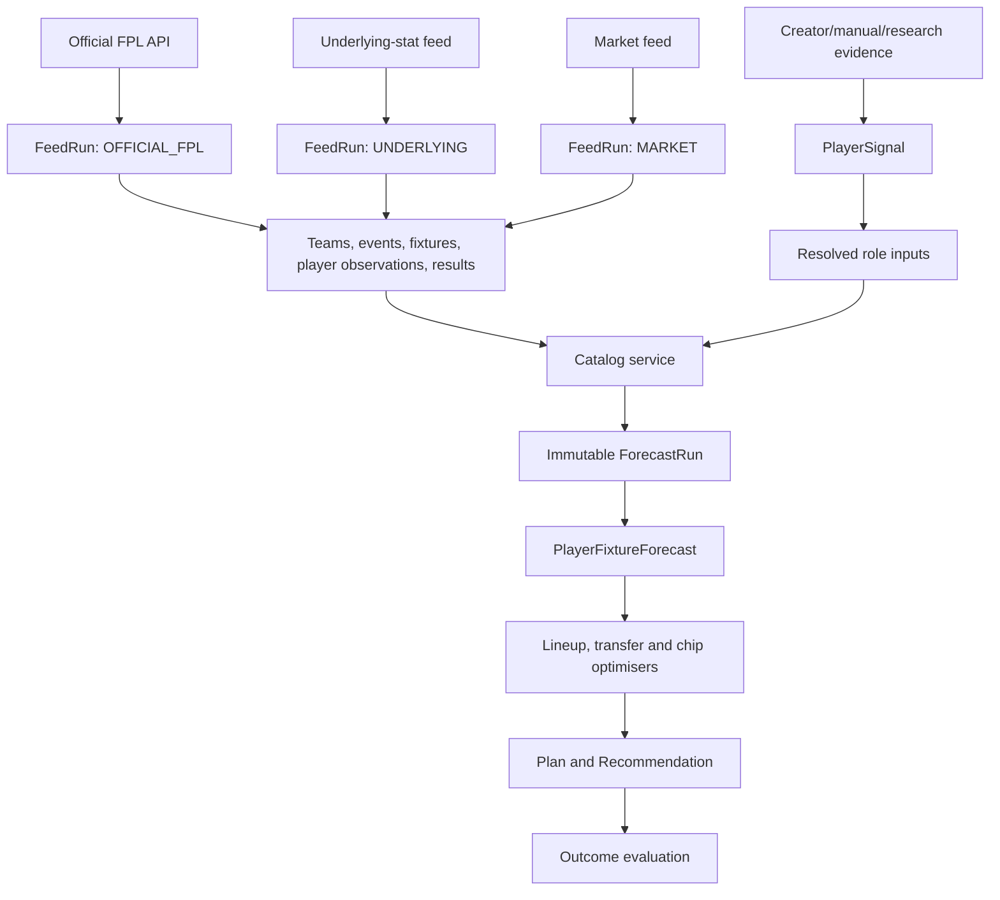

# Insomnia FPL Rebuild: Implementation Blueprint

Status: authoritative implementation specification
Audience: implementation agents and reviewers
Reset policy: development data may be discarded; backward compatibility is not required

Companion documents:

- [Data dictionary](./DATA_DICTIONARY.md)
- [Ordered work packages](./WORK_PACKAGES.md)
- [Acceptance tests](./ACCEPTANCE_TESTS.md)

## Handoff protocol

Do not ask an implementation agent to execute the entire rebuild in one turn. Give it one work package at a time, beginning with WP-00. Use this instruction:

> Implement WP-XX from `docs/WORK_PACKAGES.md`. Treat `docs/IMPLEMENTATION_BLUEPRINT.md`, `docs/DATA_DICTIONARY.md`, and `docs/ACCEPTANCE_TESTS.md` as authoritative. Inspect the current worktree and preserve unrelated changes. Do not begin the next package. Run the package acceptance checks, update `docs/IMPLEMENTATION_NOTES.md`, and report changed files, test results, deviations, and the resulting commit hash. If the documents conflict, stop and record the conflict instead of inventing a design.

After each package, a reviewer should verify the diff and acceptance output before dispatching the next package. Stronger-model review is mandatory at the gates listed in `WORK_PACKAGES.md`.

## 1. Objective

Rebuild Insomnia FPL as an explainable planning system whose recommendations are executable in the official game, reproducible from stored inputs, and measurable against later outcomes.

The rebuilt application must answer five questions reliably:

1. What is the manager's actual current squad and transfer budget?
2. What facts and assumptions produced each player forecast?
3. Which legal action has the best expected value across the selected horizon?
4. How uncertain is that advantage and what could reverse it?
5. Did prior recommendations and forecasts perform as expected?

## 2. Non-goals

- Do not authenticate to the manager's FPL account.
- Do not execute transfers, captain changes, bench changes, or chip activation on the official site.
- Do not scrape or republish paid editorial content.
- Do not allow LLM prose to override deterministic calculations.
- Do not claim a move is affordable without imported or user-confirmed selling prices.
- Do not present heuristic Wildcard or Free Hit gains as model outputs.
- Do not preserve the current development database or obsolete API compatibility.

## 3. Architectural invariants

These rules are mandatory.

### 3.1 One calculation path

All live forecasts, stored forecasts, backtests, comparisons, optimisers, and explanation contexts must call the same shared projection functions. Ingestion scripts must not reconstruct a reduced `Player` object and run a different approximation.

Target modules:

```text
src/core/scoring.ts              FPL scoring rules only
src/core/projection.ts           fixture-level expected value
src/core/uncertainty.ts          seeded outcome simulation
src/core/lineup.ts               XI, bench, captain and substitutions
src/core/transfers.ts            legality and transfer paths
src/core/optimizer.ts            draft, Wildcard and Free Hit optimisation
src/core/chips.ts                chip counterfactual evaluation
src/core/types.ts                calculation boundary types
src/server/catalog-service.ts    database-to-calculation input assembly
```

React may call pure functions from `src/core`, but it must not implement independent scoring, legality, affordability, or chip formulas.

### 3.2 Facts, assumptions and outputs remain separate

- Facts are observations from official or named external sources.
- Assumptions are manager inputs, model priors, approved signals, and calibration parameters.
- Outputs are forecasts, recommendations, plans, and explanations.

Every forecast run must identify the exact observation and assumption versions it used.

### 3.3 Forecasts are immutable

Never update a stored forecast in place. A refresh creates a new `ForecastRun` and new child rows. Backtesting selects the latest successful run created on or before the gameweek deadline.

### 3.4 Freshness is source-specific

Never use response-generation time as source freshness. Return separate timestamps for official FPL data, manager squad import, underlying statistics, markets, signals, and forecast generation.

### 3.5 Plans are not official state

The application must keep the latest imported official squad separate from one or more local plans. Applying a recommendation modifies a plan only.

### 3.6 Recommendations are reproducible

Persist the input plan, model version, forecast run, horizon, free-transfer assumption, chip state, candidate actions, selected recommendation, expected advantage, uncertainty, and eventual outcome.

## 4. Runtime and persistence decisions

- Continue using Node.js, React, TypeScript and SQLite.
- Continue using Node's `DatabaseSync` driver behind the existing asynchronous adapter.
- Remove Prisma as an executable dependency and remove the duplicate Prisma schema after the SQL schema is implemented. There must be one canonical schema.
- Add ordered SQL migrations under `db/migrations`.
- Add a `SchemaMigration` table and an idempotent migration runner.
- Enable `PRAGMA foreign_keys = ON` for normal operation and tests.
- Use WAL mode and `busy_timeout=5000`.
- Every script that opens the database must close it in `finally`.
- Database reset is an explicit script, never an automatic server-start behavior.

Required commands:

```json
{
  "db:migrate": "node scripts/db-migrate.mjs",
  "db:reset": "node scripts/db-reset.mjs",
  "db:verify": "node scripts/verify-db.mjs",
  "ingest:fpl": "node --experimental-strip-types scripts/ingest-fpl.mjs",
  "ingest:signals": "node scripts/ingest-signals.mjs",
  "forecast": "node --experimental-strip-types scripts/create-forecast-run.mjs",
  "backtest": "node --experimental-strip-types scripts/backtest-projections.mjs"
}
```

`db:reset` must require `--yes-reset-development-data` and must refuse a database path outside the repository or configured application data directory.

## 5. Target data flow



## 6. Ingestion behavior

### 6.1 Feed runs

Every external refresh begins a `FeedRun` with `RUNNING` status and ends as `SUCCEEDED`, `PARTIAL`, or `FAILED`.

Record:

- source
- start and finish timestamps
- source data timestamp when available
- request count
- inserted/updated/unmatched row counts
- cache use and cache age
- error summary
- SHA-256 payload hash or aggregate hash

A failed refresh must never make older successful observations appear fresh.

### 6.2 Official FPL ingestion

Fetch:

- `bootstrap-static/`
- `fixtures/`
- player `element-summary/{id}/` history after completed fixtures exist

Persist official player news text, news timestamp, status, chance of playing, prices, ownership, transfer counts, season totals, expected statistics and defensive-contribution fields.

The season identifier must be derived from configuration or bootstrap context. It must not be hard-coded in application logic.

Official numeric IDs are season-scoped. Resolve them to internal IDs using `(season, fpl_id)` before writing relationships.

In one database transaction:

1. Upsert season-scoped team, gameweek, fixture and player identities.
2. Insert immutable team, gameweek, fixture and player observation rows tied to the feed run.
3. Upsert completed player-fixture results.
4. Mark absent players inactive only for the same season.
5. Commit.

After commit, create one forecast run covering the configured maximum future gameweeks through the shared catalog and projection services. Forecast failure must not roll back successfully ingested facts; it must create a failed `ForecastRun` with an error.

### 6.3 Manager squad import

From `entry/{teamId}/` and `entry/{teamId}/event/{gameweek}/picks/`, persist:

- squad player IDs and official positions
- purchase price
- selling price
- bank
- squad value
- captain and vice-captain
- active chip
- transfers made and hit cost
- import gameweek and timestamp

If purchase or selling price is absent, mark the value unavailable. Do not substitute current market price silently.

Free transfers are a manager assumption unless a trustworthy source exposes the exact value. The UI must label it `User confirmed` and require confirmation after each deadline or squad sync.

### 6.4 Underlying data

Persist raw payload, source player identity, matched FPL player, match confidence, source season, capture time and rate statistics. Ambiguous matches must enter a review queue rather than selecting the first same-name player.

Do not use an observation when:

- its season differs from the active FPL season;
- its player match is unconfirmed;
- it predates a club transfer and represents the prior club without an explicit carry-forward policy; or
- its age exceeds the configured maximum.

### 6.5 Market data

Market ingestion should request sources that can provide expected-goal information, such as goal totals and both-teams-to-score, in addition to match winner probabilities.

Store de-vigged probabilities and, when derivable, home and away expected-goal estimates. H2H probabilities alone must not be converted into goal estimates. If only H2H exists, expose it as contextual evidence and do not alter scoring projections.

### 6.6 Evidence signals

Keep the current provenance, confidence, status and expiry approach, with these rules:

- Only `VERIFIED`, unexpired signals may affect forecasts.
- Opinion-only signals never alter numeric projections.
- Manual overrides take precedence and are visible in the UI.
- A verified role signal must be linked to a source or explicitly marked manual.
- Signal status changes create audit rows rather than erasing history.
- Empirical contradiction may expire a signal, but the reason and evidence must be persisted.

## 7. Catalog assembly

`catalog-service.ts` must accept an explicit `asOf` timestamp and return a complete `ProjectionInputCatalog`. It selects immutable observation rows at or before that cutoff rather than reading mutable current schedule or strength fields.

For every player, include:

- current official identity and team
- latest official observation at or before `asOf`
- latest fixture schedule and difficulty observations known at `asOf`
- latest eligible underlying observation
- eligible verified signals
- resolved role profile
- team attack and defence inputs
- optional market goal estimates
- calibration version
- data-age and confidence metadata

The same service must be used by `/api/catalog`, forecast creation, backtesting reconstruction, Model Debug, and recommendation generation.

## 8. Projection model specification

### 8.1 Expected value

Keep the existing FPL scoring implementation as the baseline, but move it into the shared core. Continue calculating appearance, goals, assists, clean sheets, goals conceded, saves, penalties, own goals, cards, defensive contributions and bonus separately.

Replace direct FDR multipliers with team goal expectations when available:

1. Preferred: market-derived home and away expected goals.
2. Fallback: official team attack/defence strength converted to expected goals and normalized to league average.
3. Last fallback: the existing bounded FDR/home-away multiplier.

The output must record which strength method was used.

Player attacking shares continue to use shrunk per-90 rates. Store the prior version and prior minutes in the forecast run configuration.

### 8.2 Role model

Represent three mutually exclusive states per fixture:

- starts
- substitute appearance
- no appearance

The probabilities must sum to one within `1e-6`. Availability modifies the state probabilities, not the scoring result after the fact.

### 8.3 Uncertainty

For each player-fixture forecast, run a deterministic seeded simulation with 2,000 samples. The seed is derived from `forecastRunId:playerId:fixtureId:modelVersion`.

For each sample:

1. Draw appearance state from the role profile.
2. Use the state's minutes assumption.
3. Draw goals and assists from Poisson distributions using the fixture-adjusted rates and minutes share.
4. Draw team goals conceded from the selected team-goal model.
5. Draw goalkeeper saves from the projected save rate.
6. Draw cards, penalty events, own goals and defensive-contribution threshold achievement from their bounded historical-rate models.
7. Draw bonus from a capped distribution fitted to the player's shrunk bonus rate.
8. Score the sample using the same FPL scoring function as actual results.

Store mean, standard deviation, p10, p50 and p90. Tests must assert deterministic repeatability for the same seed.

Do not interpret a p90-minus-p10 range as a confidence interval for model correctness; label it `outcome range under current assumptions`.

### 8.4 Calibration

Calibration must be trained only on forecasts created before the relevant deadline. Report metrics by:

- position
- horizon
- minutes-confidence band
- fixture-strength method
- model version

At minimum report sample size, MAE, RMSE, mean bias, interval coverage and rank correlation.

Do not apply a calibration group with fewer than 100 observations. Until that threshold, use factor 1 and label it uncalibrated. Cap applied multiplicative factors to `[0.85, 1.15]`.

## 9. Transfer economics and legality

For an owned player, affordability uses `sellingPrice`, never current market price. Incoming players use current purchase price.

For a sequence of transfers:

```text
bankAfter = bankBefore + sum(outgoing selling prices) - sum(incoming prices)
hitCost = max(0, numberOfTransfers - freeTransfers) * 4
```

Apply all transfers simultaneously when checking club limits and duplicates. A route is legal only if:

- every outgoing player is owned;
- every incoming player is active and not already owned unless simultaneously sold;
- positional counts remain 2/5/5/3;
- no club exceeds three players;
- `bankAfter >= 0`;
- no player occurs twice.

When exact selling prices are missing, return `AFFORDABILITY_UNKNOWN`, not `legal=true` or `legal=false`.

## 10. Decision model

### 10.1 Lineup and captain

Select an XI separately for each gameweek. Captaincy must rank expected doubled contribution while accounting for no-show probability and vice-captain fallback.

Display:

- expected points
- outcome range
- expected minutes
- role confidence
- next fixtures
- source freshness warning

### 10.2 Transfers

Support zero through five transfers. Optimisation objective:

```text
expected team points across horizon
+ captain and vice-captain contribution
+ expected automatic-substitution contribution
- hit cost
- configurable uncertainty penalty
```

Default uncertainty penalty is `0.15 * sum(player forecast standard deviations for changed-in players)`. Expose it in Model Debug; do not hide it inside expected points.

Return the top five distinct legal plans plus `ROLL`. Include raw gain, hit cost, uncertainty penalty, net expected gain, bank after, and the probability the plan beats rolling based on paired seeded simulations.

Recommend an action only when:

- exact affordability is known;
- net expected gain is positive; and
- probability of beating roll is at least 60%.

Otherwise the primary recommendation is `ROLL` or `INSUFFICIENT DATA`.

### 10.3 Chips

Every chip estimate must be a counterfactual against the same no-chip baseline.

- Triple Captain: optimise captain for each eligible gameweek; gain is the extra captain score distribution.
- Bench Boost: optimise the 15-player squad and bench configuration for the target week; gain is bench points otherwise excluded.
- Free Hit: optimise a temporary legal squad for one target gameweek, then revert to the baseline plan.
- Wildcard: optimise a permanent squad over the configured horizon with zero transfer hits and compare against the best non-Wildcard transfer plan.

Do not render Wildcard or Free Hit gains until the corresponding optimiser succeeds. Delete the existing bench-derived heuristic formulas.

## 11. Plans and decision journal

The UI must distinguish:

- `Official squad`: latest imported snapshot, read-only.
- `Active plan`: editable local plan derived from an official snapshot.
- `Saved scenarios`: named alternative plans.

Applying a transfer recommendation creates a new immutable plan revision. Undo selects the prior revision; it does not overwrite history.

When the user accepts, rejects, or ignores a recommendation, record a `DecisionRecord`. After results are available, calculate the realized point difference against the saved baseline without implying causality beyond the recorded counterfactual.

## 12. API contracts

All responses use JSON and include `schemaVersion: 1`. Validation failures return HTTP 400, missing records 404, conflicts 409, upstream unavailability 502 or 503, and unexpected failures 500.

### `GET /api/status`

Returns database health, current season/gameweek, active model version and source freshness.

### `POST /api/ingestion/fpl`

Starts official ingestion and returns `202 { runId, status }`. Reject concurrent runs with 409. In a private development deployment this endpoint may remain unauthenticated, but its mutation must be explicit.

### `GET /api/ingestion/runs`

Returns recent feed runs with counts, cache use and errors.

### `GET /api/catalog?asOf=<ISO timestamp>`

Returns assembled players, fixtures, model inputs and source freshness. `asOf` defaults to now. API objects expose internal `id` strings and official numeric `fplId` fields separately.

### `POST /api/manager/import`

Body: `{ teamId, gameweek? }`. Returns manager account, official squad snapshot, imported economics and fields requiring user confirmation.

### `GET /api/manager/current`

Returns the latest official squad, active plan, manager assumptions and chip state.

### `PATCH /api/manager/assumptions`

Updates free transfers or explicitly missing selling prices. Every update records provenance `USER_CONFIRMED` and timestamp.

### `POST /api/plans`

Creates a plan from an official snapshot or another plan revision.

### `POST /api/plans/:id/recommendations`

Body includes horizon, maximum transfers, uncertainty penalty and optional chip. Returns a persisted recommendation set.

### `POST /api/plans/:id/apply`

Applies one candidate recommendation to create a child plan revision. Never mutates official state.

### `GET /api/forecasts/latest?gameweek=<id>`

Returns the latest successful forecast run and aggregated player forecasts.

### `GET /api/forecasts/:runId/debug`

Returns inputs, component breakdown, simulation summary, calibration and provenance.

### `GET /api/backtests`

Returns metrics and explicitly reports when sample thresholds are unmet.

Existing signal-review endpoints may be retained after adapting their response envelope and audit behavior.

## 13. Caching

Implement a real server-side catalogue cache:

- memory TTL: 60 seconds by default;
- restart-cache maximum age: 24 hours by default;
- cache key includes source run IDs, signal version and model/calibration version;
- persist only successful catalogue payloads using atomic rename;
- return `cache.status` as `FRESH`, `STALE`, or `MISS`;
- stale cache is allowed only when the database or upstream assembly fails;
- source timestamps remain their original values.

League responses use a five-minute cache and a concurrency limit of five upstream requests. State clearly that EO represents the sampled managers, not the entire league, unless all pages were fetched.

## 14. Secret handling

For the development-only version:

- Prefer provider keys from environment variables.
- If a personal key must be stored, store it in one local settings file with mode `0600`; do not duplicate it in SQLite.
- Never return the full key through an API. Return `{ configured: true, provider, keySuffix }`.
- Never include keys in logs, feed payloads, forecast provenance or errors.

## 15. UI requirements

The primary dashboard must show, in this order:

1. Deadline and source-freshness state.
2. The single primary action: transfer plan, roll, or insufficient data.
3. Captain, vice-captain and best XI.
4. Expected gain and outcome range.
5. Exact economics: bank before/after, selling prices and hit.
6. Reasons the recommendation could change.
7. Alternative plans.

Use badges with these exact semantics:

- `Fresh`: source within configured target age.
- `Stale`: source exceeded target age but data is usable.
- `Missing`: required source/input unavailable.
- `Exact affordability`: all selling prices known.
- `Affordability unknown`: one or more selling prices missing.
- `Uncalibrated`: eligible observation threshold not met.

The app must never generate a demo squad silently after an official squad or saved plan has been loaded. Profile and catalogue hydration must complete before choosing initial plan state.

## 16. Observability

Structured logs must include `requestId`, `feedRunId`, `forecastRunId`, `planId` or `decisionId` where applicable. Add no third-party telemetry requirement.

`/api/status` must identify:

- last successful and failed ingestion;
- current row counts;
- forecast baseline availability;
- backtest observation count;
- cache status;
- unapplied database migrations.

## 17. Definition of done

The rebuild is complete only when:

- all work packages are complete in order;
- every acceptance test passes;
- the development database can be reset and rebuilt from commands alone;
- a squad import retains official selling prices;
- a recommendation can be reproduced from its stored IDs;
- a forecast made before a deadline cannot be overwritten;
- backtesting refuses post-deadline forecasts;
- freshness displays source ingestion time rather than response time;
- chip outputs are true counterfactual optimisations;
- no endpoint returns a full API key;
- documentation matches executable behavior.
